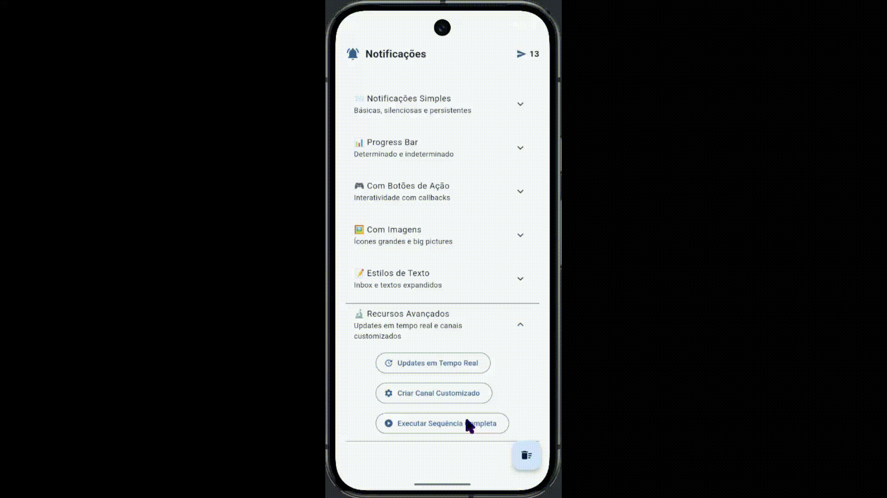
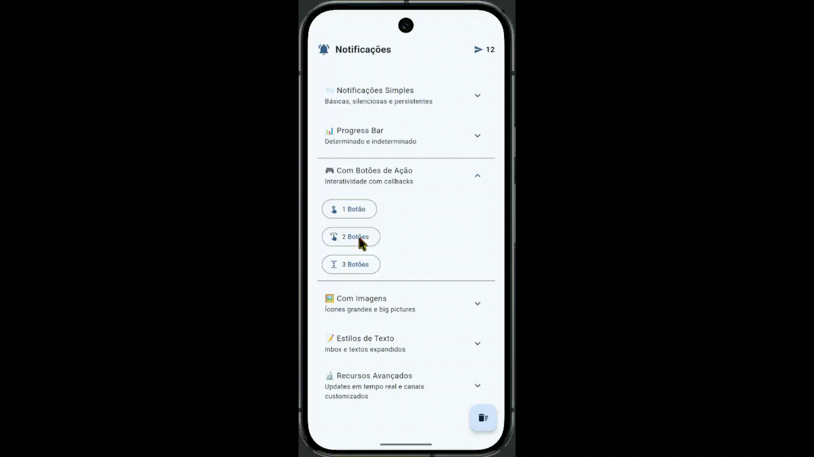
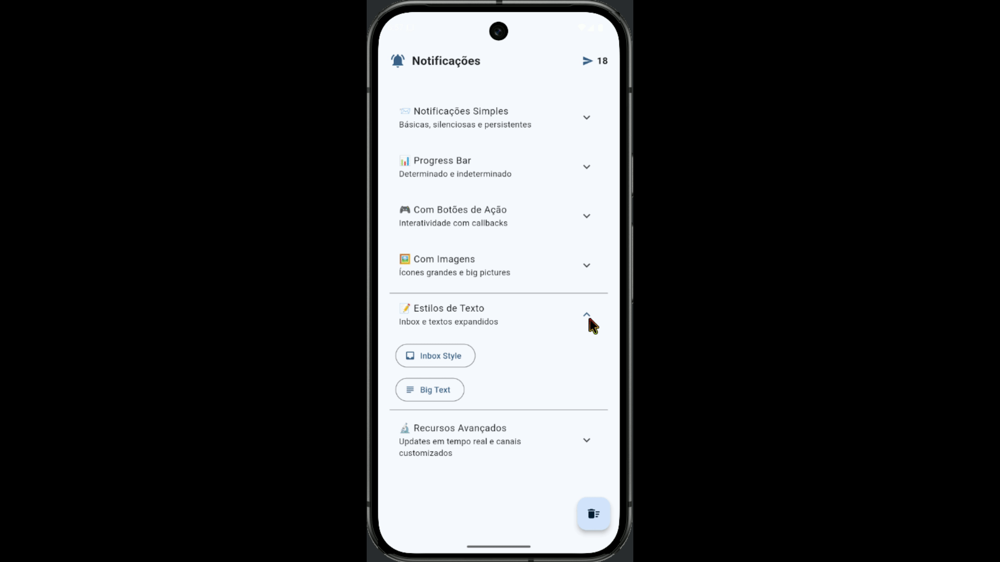
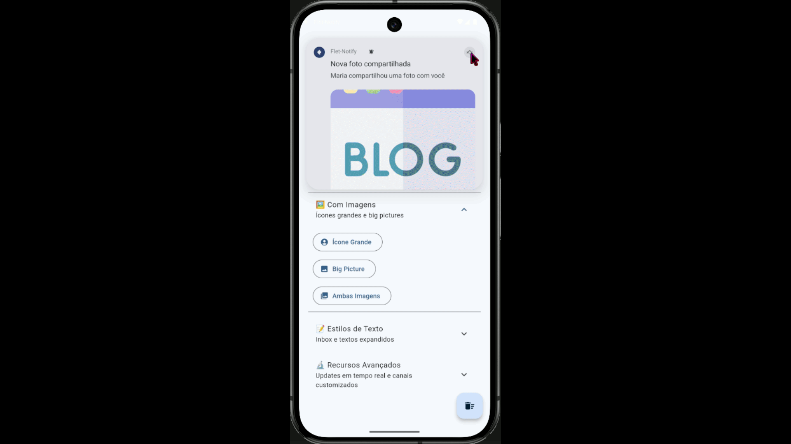

# 🔔 Flet Android Notify

<div align="center">


**Sistema completo de notificações Android para aplicativos Flet**

Uma biblioteca Python elegante e pythônica para criar notificações Android nativas com suporte a progress bars, botões interativos, múltiplos estilos e muito mais.

[Funcionalidades](#-funcionalidades) • [Instalação](#-instalação) • [Uso Rápido](#-uso-rápido) • [Documentação](#-documentação) • [Demo](#-demo-app)



</div>

---

## 🎯 Por Que Este Projeto?

Se você já tentou criar notificações Android em Flet, sabe a dor: ou você vai direto pro Java/Kotlin com JNI (spoiler: é um pesadelo), ou usa libs malucas que mal funcionam. Este projeto resolve isso de forma **pythônica**, **type-safe** e **battle-tested**.

**O diferencial?**
- ✅ API fluente e intuitiva (builder pattern)
- ✅ Suporte completo a todos os estilos Android
- ✅ Type hints em tudo (seu IDE vai te amar)
- ✅ Tratamento de erros robusto
- ✅ Documentação em português BR
- ✅ App demo completo incluído

## 🚀 Funcionalidades

### Notificações Básicas
- 📨 **Simples**: Título + mensagem clássica
- 🔇 **Silenciosas**: Sem som ou vibração
- 📌 **Persistentes**: Não podem ser fechadas com swipe


### Notificações Avançadas
- 📊 **Progress Bar**: Determinado (0-100%) e indeterminado
- 🎮 **Botões de Ação**: Até 3 botões interativos com callbacks
- 🖼️ **Imagens**: Large icon, big picture, ou ambos
- 📝 **Estilos de Texto**: Inbox style (lista de mensagens) e big text (texto longo)


### Recursos Profissionais
- ⚡ **Updates em Tempo Real**: Modifique notificações já enviadas
- 🎨 **Canais Customizados**: Controle total sobre importância e comportamento
- 🔧 **Modo Dev**: Simula notificações em Windows para desenvolvimento
- 🛡️ **Type Safety**: Enums e dataclasses para evitar erros bobos


## 📦 Instalação

### Pré-requisitos

```bash
Python 3.10+
Flet 0.28.3
Android SDK (para build)
```

### Instalação Rápida

1. **Clone o repositório:**
```bash
git clone https://github.com/Alisonsantos77/flet_android_notify.git
cd flet_android_notify
```

2. **Instale as dependências:**
```bash
pip install .
```

3. **Configure o `pyproject.toml` para Android:**
```toml
[tool.flet.android]

dependencies = [
    "pyjnius",
    "android-notify==1.60.8.dev0"
]

[[tool.flet.android.permissions]]
name = "android.permission.POST_NOTIFICATIONS"
```

4. **Build para Android:**
```bash
flet build apk
```

> **⚠️ Importante**: A biblioteca `android-notify` só funciona em dispositivos Android reais. Para desenvolvimento em Windows, o app entra automaticamente em modo simulação.

## 💻 Uso Rápido

### Exemplo Básico

```python
import flet as ft
from flet_notify import FletNotify

def main(page: ft.Page):
    notifier = FletNotify(page)
    
    if not notifier.check_permission():
        notifier.request_permission()
    
    notifier.send(
        title="Olá, Mundo!",
        message="Sua primeira notificação com Flet!"
    )

ft.app(target=main)
```

### Exemplo com Progress Bar

```python
import asyncio
from flet_notify import FletNotify

async def download_file(page):
    notifier = FletNotify(page)
    
    progress = notifier.create(
        title="Download em andamento",
        message="Baixando arquivo..."
    ).with_progress(0, 100).send()
    
    for i in range(0, 101, 10):
        await asyncio.sleep(0.5)
        progress.update_progress(i, message=f"{i}% concluído")
    
    progress.remove_progress("Download completo!", show_briefly=True)
```


### Exemplo com Botões Interativos

```python
def on_accept():
    print("Usuário aceitou!")

def on_decline():
    print("Usuário recusou!")

notifier.create(
    title="Convite de Reunião",
    message="Reunião às 15h - Confirme sua presença"
).add_button("Aceitar", on_accept)\
 .add_button("Recusar", on_decline)\
 .send(persistent=True)
```



### Exemplo com Inbox Style

```python
notifier.create(
    title="5 novas mensagens",
    message="WhatsApp"
).add_line("João: E aí, tudo certo?")\
 .add_line("Maria: Reunião às 15h!")\
 .add_line("Pedro: PR aprovado! 🎉")\
 .add_line("Ana: Parabéns!")\
 .add_line("Carlos: Pizza hoje?")\
 .send()
```



### Exemplo com Imagens

```python
notifier.create(
    title="@usuario comentou",
    message="Que foto incrível! Adorei os detalhes."
).set_large_icon("assets/profile.png")\
 .set_big_picture("assets/post.png")\
 .send()
```



## 📚 Documentação Completa

### API Reference

#### `FletNotify(page: ft.Page)`

Classe principal para gerenciar notificações.

**Métodos:**

| Método | Descrição | Retorno |
|--------|-----------|---------|
| `check_permission()` | Verifica se tem permissão para notificações | `bool` |
| `request_permission()` | Solicita permissão ao usuário | `bool` |
| `send(title, message, ...)` | Envia notificação simples | `FletNotification` |
| `create(title, message, ...)` | Cria builder para notificação customizada | `NotificationBuilder` |
| `create_channel(...)` | Cria canal de notificação customizado | `None` |
| `cancel_all()` | Cancela todas as notificações ativas | `None` |

#### `NotificationBuilder`

Builder fluente para criar notificações complexas.

**Métodos de Configuração:**

```python
builder = notifier.create("Título", "Mensagem")

builder.set_icon("assets/icon.png")
builder.add_button("Ação", callback_function)
builder.with_progress(current=0, max_value=100)
builder.set_large_icon("assets/profile.png")
builder.set_big_picture("assets/photo.png")
builder.set_big_text("Texto longo...")
builder.add_line("Linha 1")
builder.add_line("Linha 2")

notification = builder.send(
    silent=False,
    persistent=False,
    close_on_click=True
)
```

#### `FletNotification`

Objeto retornado após enviar uma notificação. Permite updates em tempo real.

**Métodos:**

```python
notification = notifier.send(...)

notification.update_title("Novo Título")
notification.update_message("Nova mensagem")
notification.update_progress(
    current=50,
    title="Baixando...",
    message="50% concluído"
)
notification.remove_progress(
    final_message="Concluído!",
    show_briefly=True
)
notification.cancel()
```

### Enums Disponíveis

#### `NotificationImportance`

Controla o nível de importância da notificação:

```python
NotificationImportance.URGENT   # Máxima prioridade (som + heads-up)
NotificationImportance.HIGH     # Alta prioridade (som)
NotificationImportance.MEDIUM   # Média prioridade (sem som)
NotificationImportance.LOW      # Baixa prioridade (minimizada)
NotificationImportance.NONE     # Sem notificação visível
```

#### `NotificationStyle`

Define o estilo visual da notificação:

```python
NotificationStyle.SIMPLE        # Título + mensagem simples
NotificationStyle.PROGRESS      # Com barra de progresso
NotificationStyle.INBOX         # Lista de mensagens
NotificationStyle.BIG_TEXT      # Texto longo expansível
NotificationStyle.LARGE_ICON    # Com ícone grande
NotificationStyle.BIG_PICTURE   # Com imagem grande
NotificationStyle.BOTH_IMAGES   # Ícone + imagem
```

## 🎨 Demo App

O projeto inclui um app de demonstração completo com todas as funcionalidades.


### Rodando o Demo Localmente

```bash
# Windows (modo simulação)
flet run src/main.py

# Android (notificações reais)
flet build apk
```

### Estrutura do Demo

```
src/
├── main.py              # App principal com UI completa
├── flet_notify.py       # Biblioteca core
└── assets/              # Recursos (imagens, ícones)
```

O demo inclui exemplos de:
- ✅ Todos os tipos de notificações
- ✅ Progress bars animados
- ✅ Botões interativos
- ✅ Updates em tempo real
- ✅ Canais customizados
- ✅ Sequências complexas

## 🛠️ Desenvolvimento

### Estrutura do Projeto

```
flet_android_notify/
├── src/
│   ├── main.py                 # App demo completo
│   ├── flet_notify.py          # Biblioteca principal
│   └── assets/                 # Recursos do app
├── pyproject.toml              # Config do Flet
├── README.md                   # Este arquivo
└── LICENSE                     # Licença MIT
```

### Modo Desenvolvedor

O projeto detecta automaticamente quando está rodando fora do Android e entra em "modo dev":

```python
self.dev_mode = page.platform != ft.PagePlatform.ANDROID

if self.dev_mode:
    self._increment_counter()
    self._show_snack(f"🔧 DEV: Simulando '{action_name}'")
    return True
```

Isso permite desenvolver e testar a UI completa sem precisar buildar para Android toda hora.

## 🐛 Troubleshooting

### Problema: "PlatformNotSupportedException"
**Causa**: Tentando usar notificações em plataforma não suportada.
**Solução**: O modo dev deveria detectar automaticamente. Verifique se está usando a versão mais recente.

### Problema: "PermissionDeniedException"
**Causa**: Usuário negou permissão de notificações.
**Solução**: 
```python
if not notifier.check_permission():
    notifier.request_permission()
```

### Problema: "AndroidNotifyNotAvailableException"
**Causa**: Biblioteca `android-notify` não instalada ou não configurada.
**Solução**: Verifique o `pyproject.toml`:
```toml
[tool.flet.android]
dependencies = ["android-notify==1.60.8.dev0"]
```

### Problema: Notificações não aparecem no Android 13+
**Causa**: Falta permissão POST_NOTIFICATIONS.
**Solução**: Adicione ao `pyproject.toml`:
```toml
[[tool.flet.android.permissions]]
name = "android.permission.POST_NOTIFICATIONS"
```

## 🤝 Contribuindo

Contribuições são super bem-vindas! Seja fixando um bug, adicionando feature, ou melhorando a documentação.

### Como Contribuir

1. Fork o projeto
2. Crie uma branch para sua feature (`git checkout -b feature/MinhaFeature`)
3. Commit suas mudanças (`git commit -m 'feat: Adiciona MinhaFeature'`)
4. Push para a branch (`git push origin feature/MinhaFeature`)
5. Abra um Pull Request

### Convenções de Commit

Usamos [Conventional Commits](https://www.conventionalcommits.org/):

```
feat: Nova funcionalidade
fix: Correção de bug
docs: Mudanças na documentação
style: Formatação, ponto e vírgula, etc
refactor: Refatoração de código
chore: Tarefas de manutenção
```

## 📜 Licença

Este projeto está sob a licença MIT. Veja o arquivo [LICENSE](LICENSE) para mais detalhes.

## 💡 Inspiração e Créditos

Este projeto foi inspirado e construído com base no excelente trabalho de **[Agusss (MasterA5)](https://github.com/Agusss)**, especialmente seu repositório [FletNotification](https://github.com/Agusss/FletNotification).

Fundamental para entender como integrar notificações Android com Flet usando PyJNIus e a biblioteca android-notify. Muitos conceitos e patterns utilizados aqui foram adaptados e expandidos a partir daquele trabalho pioneiro.

**Principais diferenças deste fork/reimplementação:**
- 🏗️ Arquitetura refatorada com builder pattern
- 📝 Documentação completa em português BR
- 🎨 App demo profissional e completo
- 🛡️ Type hints e type safety
- 🔧 Modo desenvolvedor para testes locais
- 📊 Suporte expandido a todos os estilos de notificação

## 👨‍💻 Autor

**Alison Santos**  
🇧🇷 Desenvolvedor Backend Python  
📧 [GitHub](https://github.com/Alisonsantos77)

---

<div align="center">

**Se este projeto foi útil, deixe uma ⭐!**

Feito com ❤️ e muitos ☕ por desenvolvedores Python

[⬆ Voltar ao topo](#-flet-android-notify)

</div>